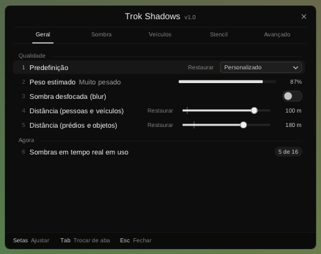
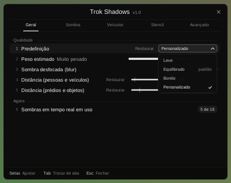
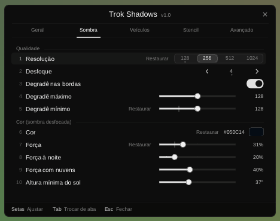
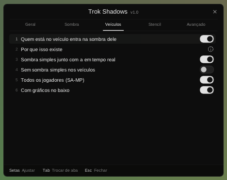
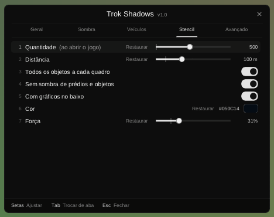
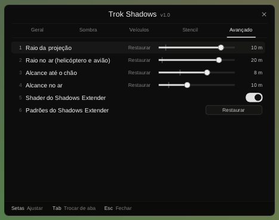

# Trok Shadows Menu — menu e correções para o Shadows Extender 2.0

Um `.asi` que vai **junto** do Shadows Extender 2.0 (DK22Pac). O `shadows.asi` original continua como está; este complemento:

- **corrige o escurecimento dobrado no veículo:** com a sombra desfocada (blur), onde a sombra do piloto cruzava a da moto (ou a do passageiro, a do carro) ficava mais escuro;
- **corrige o `DisplayShadowsAtLowSettings` do `[STENCIL_SHADOWS]`:** o Shadows Extender lia a chave do `[REALTIME_SHADOWS]` duas vezes, e a do stencil nunca valia;
- **põe um menu na tela** para mexer em tudo do `shadows.ini` com o jogo aberto, com limites que não derrubam o FPS e predefinições prontas. Cada mudança vale na hora e fica gravada no `shadows.ini`.

> **Estado:** versão 1.0, compilada e testada sem o jogo. No Wine, com o `shadows.asi` original de verdade, passam as 64 conferências do `test/run.sh`; o menu, desenhado em imagens pelo `test/render.sh`, passa as 8 dele. Ainda não foi testada dentro do jogo.

 
 
 

## Instalar

1. Deixe o Shadows Extender 2.0 instalado como sempre: `shadows.asi`, `shadows.ini`, `shadows_pixel.fx` e `shadows_pixel_stencil.fx` (e o `d3dx9_43.dll` que ele precisa).
2. Copie `dist/Trok Shadows Menu.asi` para a mesma pasta do `shadows.asi` (a do `gta_sa.exe` ou `scripts\`).
3. Se você testou o Trok Shadows (a versão refeita, `trok-shadows/`), tire o `Trok Shadows.asi` e o `Trok Shadows.ini`: os dois não rodam juntos com o original.

Precisa do `gta_sa.exe` 1.0 US. No SA-MP 0.3.7 R1 o menu abre com **/sombras** (ou /trokshadows); sem o SA-MP (ou em outra versão dele), com **F11**. Setas ajustam, Tab troca de aba, Esc fecha; o mouse também funciona.

A fonte é a da casa (`moonloader\resource\trok\font.ttf`) se ela estiver na pasta do jogo; se não, a Arial do Windows.

## O menu

| Aba | O que tem | Chave no `shadows.ini` |
|---|---|---|
| **Geral** | Predefinição (Leve, Equilibrado, Bonito) | resolução, desfoque e as duas distâncias de uma vez |
| | Peso estimado: quanto a placa de vídeo trabalha com a sombra em tempo real | — |
| | Sombra desfocada (blur) | `CombineRealTimeShadowsWithStencil` ao contrário |
| | Distância (pessoas e veículos) | `[REALTIME_SHADOWS] MaxDistance` |
| | Distância (prédios e objetos) | `[STENCIL_SHADOWS] MaxDistance` |
| | Sombras em tempo real em uso (das 16 vagas do jogo) | — |
| **Sombra** | Resolução, Desfoque, Degradê nas bordas, Degradê máximo e mínimo | `RasterSize` (as outras três ficam na metade), `BlurLevel`, `CreateBlur2`, `GradientMax`, `GradientMin` |
| | Cor e Força (as do stencil no modo combinado, as da sombra em tempo real no desfocado) | `R` `G` `B` `A` |
| | Força à noite, Força com nuvens | `ShadowIntensityNightFactor`, `ShadowIntensityCloudsFactor` |
| | Altura mínima do sol | `ShadowSunZLimit` (em graus) |
| **Veículos** | Quem está no veículo entra na sombra dele (a correção) | `[TROK_MENU] CorrigirVeiculo` |
| | Sombra simples junto com a em tempo real, Sem sombra simples nos veículos | `DrawVehicleDefaultShadowWithRealTime`, `DisableVehicleDefaultShadow` |
| | Todos os jogadores (SA-MP), Com gráficos no baixo | `MoreThanOnePlayer`, `[REALTIME_SHADOWS] DisplayShadowsAtLowSettings` |
| **Stencil** | Quantidade, Distância, Todos os objetos a cada quadro, Sem sombra de prédios e objetos, Com gráficos no baixo, Cor e Força | `MaxShadows`, `MaxDistance`, `FlagIgnoreSomeShadows`, `DisableBuildingShadows`, `DisplayShadowsAtLowSettings`, `R` `G` `B` `A` |
| **Avançado** | Raio da projeção (e no ar), Alcance até o chão (e no ar), Shader, Padrões do Shadows Extender | `ShadowBoundSphere(InAir)`, `ShadowZDistanceLimit(InAir)`, `EnableShadowsShader` |

Barras, setas, cores e a resolução fora do padrão do Shadows Extender ganham um "Restaurar" (na predefinição, ele volta para o Equilibrado, o recomendado). "Padrões do Shadows Extender" volta tudo de uma vez (menos a correção do veículo) e grava. Com o shader desligado e o blur desligado, a aba Avançado avisa: o modo junto com o stencil precisa do shader.

### Limites

| Controle | Faixa no menu |
|---|---|
| Resolução | 128, 256, 512 ou 1024 px (2048 fica de fora: com 16 sombras passa de meio giga de memória de vídeo) |
| Desfoque | 0 a 8 |
| Distância (pessoas e veículos) | 10 a 120 m |
| Distância (prédios e objetos) | 20 a 250 m |
| Quantidade do stencil | 64 a 1024 |
| Raio da projeção / no ar | 1 a 12 m / 1 a 25 m |
| Alcance até o chão / no ar | 1 a 12 m / 1 a 25 m |
| Altura mínima do sol | 10° a 80° |

Um valor do `shadows.ini` fora da faixa fica como está até você mexer nele no menu.

| Predefinição | Resolução | Desfoque | Pessoas e veículos | Prédios e objetos |
|---|---|---|---|---|
| Leve | 128 px | 2 | 30 m | 60 m |
| Equilibrado | 256 px | 4 | 50 m | 100 m |
| Bonito | 512 px | 6 | 80 m | 150 m |

### O que vale na hora

- **Na hora:** cores e forças, sombra desfocada, distâncias, noite e nuvens, sol, raios e alcances, sombra simples dos veículos, a correção do veículo, desfoque e degradê nas bordas (nas 16 sombras que já existem).
- **No quadro seguinte:** resolução e os valores do degradê. As 16 sombras em tempo real são criadas de novo. Se a placa recusar uma resolução, o menu volta para a última que funcionou e escreve no log.
- **Shader:** desliga e liga na hora, se o Shadows Extender compilou os shaders ao abrir o jogo.
- **Os liga/desliga** (todos os objetos a cada quadro, sem sombra de prédios, gráficos no baixo, sombra simples junto, todos os jogadores): na hora quando o byte original do jogo é conhecido. Ele vem da memória (se o Shadows Extender não mexeu ali) ou do `gta_sa.exe` no disco (se o arquivo tem o mesmo código da memória). Se não der, vale quando o jogo abrir de novo, e o menu avisa.
- **Quantidade do stencil:** quando o jogo abrir de novo (o jogo cria essas sombras uma vez só).

O `shadows.ini` é gravado um segundo depois da última mudança, ou quando o menu fecha. Só as chaves que mudaram são trocadas: os comentários, o alinhamento e a ordem ficam como estavam. A correção do veículo vai numa seção nova, `[TROK_MENU]`, só se você desligar.

## Como funciona

Todos os endereços são do `gta_sa.exe` 1.0 US. Os do Shadows Extender são relativos ao começo do `shadows.asi` já descompactado (ele vem com ASPack).

- **Acha o Shadows Extender** pelo nome `shadows.asi` ou, se foi renomeado, pelo conteúdo de cada módulo carregado: os textos `2.0`, `Shadows Extender` e `shadows.ini` e o código do gancho do pedestre. Espera ele terminar de iniciar (o gancho dele em `0x706676`) e lê os valores em uso: das variáveis dele, dos `push` que ele escreveu no jogo e dos bytes que ele trocou.
- **Evento de quadro:** a chamada de `CGame::Process` em `Idle` (`0x53E981`), encadeada com quem já estiver lá.
- **Correção do veículo:**
  - `CPed::PreRenderAfterTest` (`0x5E6664`): o Shadows Extender troca a atualização dos ossos por uma função dele que também pede sombra em tempo real para todo pedestre. O complemento fica na frente: um pedestre dentro de um veículo que já tem sombra em tempo real só atualiza os ossos. Se o veículo ficou sem sombra (as 16 vagas em uso), o pedestre continua com a dele. O pedido do próprio jogo para quem anda de moto o Shadows Extender já apaga (`0x5E68A2`).
  - `CRealTimeShadow::Update` (`0x706676`): o Shadows Extender desvia para o trecho dele que desenha a arma e fecha a câmera da sombra. O complemento entra antes, com a câmera ainda aberta: se o dono da sombra é um veículo, desenha o motorista e até 8 passageiros em silhueta (sem textura, luz e cor, como o jogo desenha o dono). Depois segue para o trecho do Shadows Extender com todos os registradores como estavam.
- **Valores na hora:** o complemento escreve nas variáveis do Shadows Extender que ele relê a cada quadro (cores, modo combinado, fatores, raios, alcances, sol, sombra simples, shader) e nos lugares do jogo que ele escreveu uma vez (`MAX_DISTANCE_PED_SHADOWS` em `0x8D5240` e o quadrado em `0xC4B6B0`; a distância do stencil, que o jogo lê por ponteiro na variável dele).
- **Sombras criadas de novo:** com a resolução nova, no evento de quadro (entre `CGame::Process` e a atualização das sombras, quando nenhuma está guardada para desenhar): devolve as sombras em uso (`ReturnRealTimeShadow`, `0x705B30`), `CRealTimeShadowManager::Exit` (`0x706A60`), escreve os `push` de `CRealTimeShadow::Create` e `CRealTimeShadowManager::Init` (`0x7064C2`, `0x7064F9`, `0x706810`–`0x706832`) e o degradê (`0x8D5218`, `0x8D521C`), e `Init` (`0x7067C0`). Confere as câmeras de cada sombra; sem elas, volta para a última resolução que funcionou.
- **Liga/desliga:** os mesmos bytes que o Shadows Extender troca ao abrir o jogo: `0x711E3D`, `0x711E41`, `0x711D9D` e `0x7113C0` (stencil), `0x706BCC` e `0x5E6766` (tempo real no gráfico baixo), `0x70BDAB` (sombra simples junto) e `0x7069F5` (todos os jogadores).
- **Menu:** o mesmo gancho dos mods da casa (`trok-ui/asi`): `Present` e `Reset` do `d3d9.dll`, lidos do arquivo em disco, desviados com o MinHook; o desenho é o kit do Trok UI. O `/sombras` é registrado no SA-MP 0.3.7 R1.

**Log** em `Trok Shadows Menu.log`, ao lado do `.asi`: o que foi achado, aplicado, recriado e gravado.

## Compilar

```
./build.sh
```

Precisa do MinGW i686 (`g++-mingw-w64-i686-posix` e `gcc-mingw-w64-i686-posix`) e do git (o Dear ImGui 1.89.9 e o MinHook vêm do `trok-ui/asi/third_party`, baixados se faltarem). O `.asi` sai em `dist/`.

## Testes (sem o jogo)

```
test/run.sh      # o complemento com o shadows.asi original, no Wine
test/render.sh   # o menu desenhado em PNG, no Linux
```

O `test/run.sh` precisa de `wine` (com `wine32`), `xvfb-run`, MinGW i686 e dos arquivos do Shadows Extender 2.0 em `test/original/` (`shadows.asi`, `shadows_pixel.fx`, `shadows_pixel_stencil.fx`; ou numa pasta indicada em `SHADOWS_EXTENDER`). Eles são do DK22Pac e não vão para o git.

O `test/launcher.exe` ocupa a faixa de endereços do `gta_sa.exe` (`0x400000`–`0xD00000`); o `test/host.cpp` monta ali os pontos do 1.0 US, carrega o `shadows.asi` original e o complemento, dispara os eventos e chama os ganchos com dados falsos. As funções do jogo viram gravadores. Os modos:

- **completo** (o `test/shadows.ini`, tudo ligado): o complemento acha o original e liga a correção; os valores lidos batem com o INI; o piloto não pede sombra própria quando a moto tem a dela, e pede quando ela ficou sem; a sombra da moto desenha o piloto e a garupa em silhueta antes de o original fechar a câmera, com os registradores como o original deixa; os valores mudados chegam ao original e ao jogo; a resolução nova recria as sombras no quadro seguinte (e volta se a placa recusar); o `shadows.ini` é gravado sem perder os comentários.
- **liga_desliga** (tudo desligado no INI): o `DisplayShadowsAtLowSettings` do stencil corrigido; cada liga/desliga liga e volta ao byte original.
- **renomeado:** o `shadows.asi` com outro nome é achado pelo conteúdo.
- **sem_original:** sem o Shadows Extender, o complemento só avisa e não mexe no jogo.

O `test/render.sh` roda o menu com um Shadows Extender falso (os valores do `test/shadows.ini`), confere predefinições, blur, gravação, quantidade do stencil e padrões, e grava as imagens das abas em `test/out/menu/`.

## Créditos

- Shadows Extender: DK22Pac.
- Nomes e estruturas do jogo: gta-reversed e plugin-sdk.
- Dear ImGui (Omar Cornut) e MinHook (Tsuda Kageyu).
