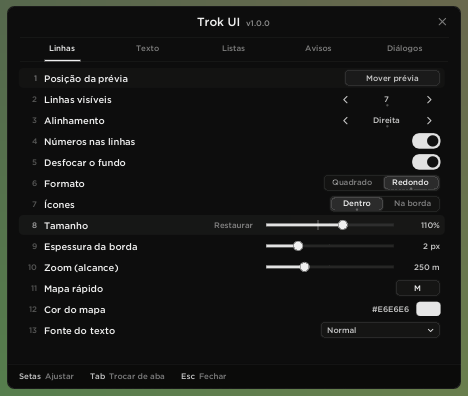
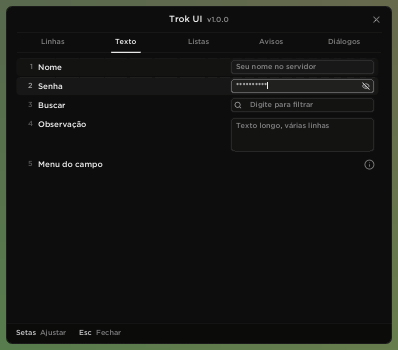
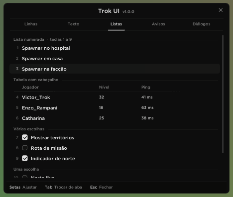
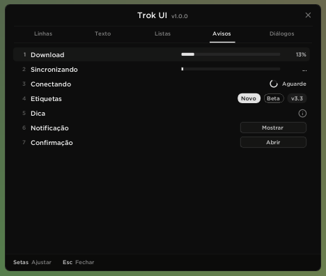
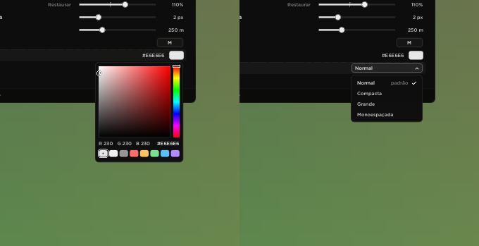
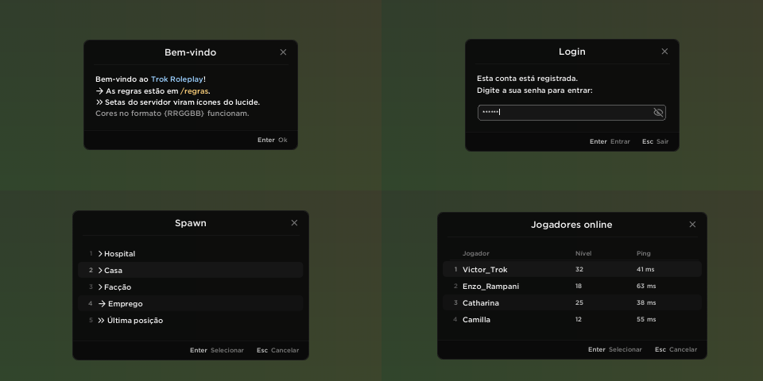
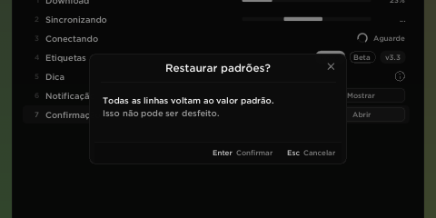
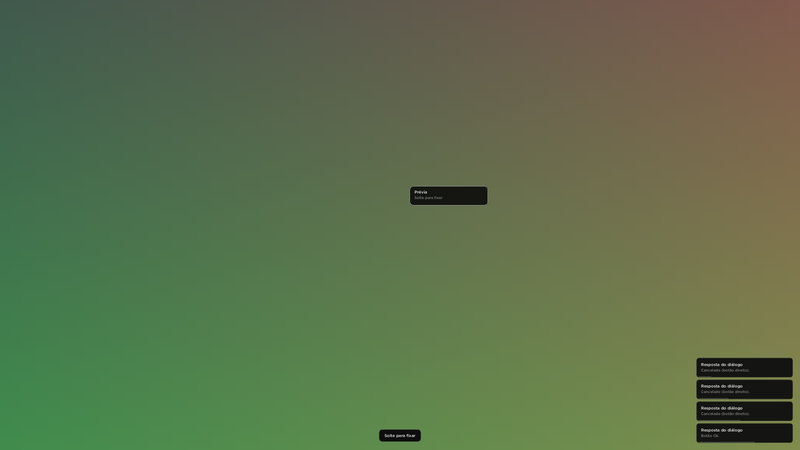

# Trok UI — vitrine de controles de menu

Dois mods de visualização com **todos os controles de menu da casa**, um em **Lua (mimgui)** e outro em **.asi (C++ / Dear ImGui 1.89.9)**. Servem de referência para que os próximos mods sigam a mesma estética do Trok Kill List, do Trok Dialogs e do Trok Radar.

| Mod | Arquivo | Abre com |
|---|---|---|
| Lua | `lua/Trok UI Showcase.lua` | `/trokuilua` |
| .asi | `asi/dist/Trok UI Showcase.asi` | `/trokui` (sem SA-MP 0.3.7 R1: **F10**) |

Os dois são a mesma vitrine, com 5 abas (**Linhas, Texto, Listas, Avisos, Diálogos**), diálogos de exemplo, confirmação, notificações e o modo de mover.

## Instalar

- **Lua:** copie `Trok UI Showcase.lua` para `moonloader\`. Precisa de mimgui e SAMPFUNCS, como o Kill List. Comando: `/trokuilua`. Se o mimgui não iniciar em 2 s, o chat avisa e o motivo fica em `moonloader\moonloader.log`.
- **.asi:** copie `Trok UI Showcase.asi` para a pasta do GTA (ao lado do `gta_sa.exe`) ou para `scripts\`. Comando: `/trokui` (sem SA-MP 0.3.7 R1, F10). O log fica em `Trok UI Showcase.log`, ao lado do .asi. Se o desenho não estiver ativo quando você digitar `/trokui`, o chat avisa.
- **Fontes da casa (os dois mods):** `moonloader\resource\trok\font.ttf` (Gotham Medium) e `moonloader\resource\trok\lucide.ttf`, os mesmos arquivos que o Kill List já usa. Sem eles, o texto cai para Arial e os ícones viram desenhos vetoriais no mesmo traço.

## Fonte e ícones

- **Texto:** `font.ttf` em 3 tamanhos: corpo **16u**, título **20u** e descrição **13.5u** (números, valores, dicas, versão).
- **Ícones:** `lucide.ttf` em **18u** (e **13u** para os pequenos: check, lupa, setinha da lista suspensa).
- **Escala:** `u = max(0.55, altura_da_tela / 1080 * 0.85)`. Toda medida deste guia está em `u`.

O kit usa os códigos oficiais do Lucide. O `lucide.ttf` da casa (o mesmo embutido no Dialogs e no Radar) é um recorte com 6 ícones. O kit usa o glifo quando ele existe; quando não existe, desenha no mesmo traço:

| Ícone | Código | No lucide da casa? | Onde aparece |
|---|---|---|---|
| x (fechar) | `U+0078` (oficial `U+E1B2`) | sim | X do cabeçalho, limpar busca |
| chevron-right | `U+E06F` | sim | setas `<  >`, lista suspensa (espelhado/girado para as outras direções), token `>` |
| chevrons-right | `U+E073` | sim | token `>>` e `»` no texto do servidor |
| arrow-right | `U+E049` | sim | tokens `->` e `=>` no texto do servidor |
| eye / eye-off | `U+E0BA` / `U+E0BB` | sim | campo de senha |
| check | `U+E06C` | não (vetor) | caixa de marcar, item escolhido da lista suspensa |
| search | `U+E151` | não (vetor) | campo de busca |
| info | `U+E0F9` | não (vetor) | linha com dica (i) |
| chevron-left / down / up | `U+E06E` / `U+E06D` / `U+E070` | não (usa o chevron-right espelhado/girado) | setas e lista suspensa |

Para ter todos como glifo, gere o recorte com os códigos acima (por exemplo, `pyftsubset lucide.ttf --unicodes=U+0078,U+E049,U+E06C-E070,U+E073,U+E0BA,U+E0BB,U+E0F9,U+E151,U+E1B2`, mantendo o `x` em `U+0078`). O kit já procura esses códigos.

## Guia de estilo

### Paleta (monocromática)

| Token | Valor | Uso |
|---|---|---|
| fundo da janela | `#0C0C0C` 98.8% | janela |
| borda | branco 5.5% (14) | contorno da janela |
| `text` | `240` | rótulos, valor em hover |
| `column` | `200` | valores, teclas do rodapé |
| `hint` | branco 118 | ações do rodapé, placeholders, abas inativas |
| `disabled` | branco 42 | seta no limite |
| `version` | `140` | versão ao lado do título |
| `separator` | branco 10 | divisores |
| `selection` / `hover` | branco 10 / 6 | fundo da linha selecionada / com o mouse |
| `number` / hover / selecionado | branco 78 / 110 / 150 | número à esquerda da linha |
| `strong` | `226` | "ligado": trilho do toggle, barra, marcas |
| `ink` | `18` | texto e marca sobre o `strong` |
| `marker` | branco 70 | ponto do valor padrão |

### Medidas

- **Janela:** cantos de 10u e padding de 18u × 16u. Configuração com abas: 640u de largura e altura de até 72% da tela. Configuração simples: 420u.
- **Cabeçalho (44u):** título e versão centralizados, divisor, X do lucide à direita. Arrastar pelo cabeçalho move a janela.
- **Abas (34u):** largura igual para todas, texto em 13.5u e indicador de 2u que desliza sob a aba ativa (texto + 7u de cada lado).
- **Linha (28u, intervalo de 2u):** recuo de 12u, número à esquerda, rótulo em 16u, controle à direita. Fundo da seleção e do hover com cantos de 6u.
- **Rodapé (36u):** faixa preta a 18% e dicas `Tecla Ação`, com 6u entre tecla e ação e 22u entre dicas. Na configuração ficam à esquerda; nos diálogos, à direita (`Enter Ok`, `Esc Cancelar`). Dicas clicáveis acendem no hover.
- **Rolagem:** barra fina de 4u.

### Regras de comportamento

1. **Teclado em tudo:** ↑/↓ escolhem a linha, ←/→ ajustam, Enter ativa, Espaço marca, Tab/Shift+Tab trocam de aba, 1–9 escolhem itens de lista, Esc fecha (primeiro o popup aberto, depois a janela). A linha escolhida pelo teclado rola para ficar visível.
2. **Valor padrão sempre marcado:**
   - **Barras:** linha vertical no ponto padrão (por baixo da bolinha), como no Trok Radar.
   - **Setas e giro:** ponto sob o valor quando ele é o padrão.
   - **Segmentado:** ponto sob a opção padrão.
   - **Lista suspensa:** etiqueta "padrão" na opção.
   - **Cor:** a primeira amostra do seletor é a cor padrão, com o ponto.
   - **Todos:** **Restaurar** aparece à esquerda do controle quando o valor sai do padrão, e a dica mostra qual é o padrão.
3. **Botões e cliques:** primeiro os botões invisíveis do controle (eles ganham o hover), depois o fundo da linha, e o desenho por último. Nada usa os widgets cinza do ImGui.
4. **Primeiro quadro sem teclado:** o Enter que mandou o comando (ou abriu a tela) não aciona nada dentro dela.
5. **Bloqueio de teclas:** com o menu aberto, o jogo não recebe teclas nem cliques. As teclas soltas (*key up*) sempre passam, para nenhuma tecla ficar presa no GTA. Com o menu de pausa aberto, nada é bloqueado.
6. **Cursor:** o pedido de cursor é publicado na propriedade `TrokCursor.Pedido` da janela do jogo (1 = mãozinha, 2 = I de texto), como no Kill List. No .asi, o cursor do SA-MP fica no modo 2, como no Dialogs.
7. **Texto do servidor:** cores `{RRGGBB}` e as setas `>`, `>>`/`»`, `->`/`=>` viram ícones do lucide, como no Trok Dialogs.

### Catálogo de controles

| # | Controle | Origem | Lua (`Rows`) | C++ (`tui::Rows`) |
|---|---|---|---|---|
| 1 | Ação (botão com contorno) | Kill List "Mover lista" | `r:action(rótulo, botão)` | `Action` |
| 2 | Número com setas `< 7 >` | Kill List "Linhas visíveis" | `r:stepper(...)` | `Stepper` |
| 3 | Opção que gira `< Direita >` | Kill List "Alinhamento" | `r:cycle(...)` | `Cycle` |
| 4 | Interruptor | Radar | `r:toggle(...)` | `Toggle` |
| 5 | Segmentado | Radar (Quadrado/Redondo) | `r:segmented(...)` | `Segmented` |
| 6 | Barra com valor (`%`, `px`, `m`) | Radar | `r:slider(...)` | `Slider` |
| 7 | Tecla de atalho | Radar (`tecla_mapa`) | `r:keybind(...)` | `Keybind` |
| 8 | Cor (hex + amostra + seletor S/V, matiz, RGB) | Radar | `r:color(...)` | `Color` |
| 9 | Lista suspensa | nova | `r:dropdown(...)` | `Dropdown` |
| 10 | Campo de texto (+ menu Copiar/Colar/Recortar/Limpar) | Dialogs | `r:input(...)` | `Input` |
| 11 | Senha com olho | Dialogs | `r:input(..., true)` | `Input(..., true)` |
| 12 | Busca (lupa + limpar) | nova | `r:search(...)` | `Search` |
| 13 | Texto longo | nova | `r:multiline(...)` | `Multiline` |
| 14 | Barra de progresso / indeterminada | nova | `r:progress(...)` | `Progress` |
| 15 | Carregando (anel) | nova | `r:loading(...)` | `Loading` |
| 16 | Etiquetas (forte, contorno, neutra) | nova | `r:badges(...)` | `Badges` |
| 17 | Linha com dica (i) | nova | `r:info(...)` | `Info` |
| 18 | Título de seção | nova | `r:section(...)` | `Section` |
| 19 | Item de lista numerada (1–9, clique duplo) | Dialogs | `r:item(...)` | `Item` |
| 20 | Tabela com cabeçalho | Dialogs (TABLIST_HEADERS) | `r:tableHeader` / `r:tableItem` | `TableHeader` / `TableItem` |
| 21 | Várias escolhas (caixa de marcar) | nova | `r:checkItem(...)` | `CheckItem` |
| 22 | Uma escolha (bolinha) | nova | `r:radioItem(...)` | `RadioItem` |
| — | Janela (cabeçalho, X, arrastar, rodapé com dicas) | Kill List / Dialogs / Radar | `ui.beginShell` / `ui.endShell` | `BeginShell` / `EndShell` |
| — | Abas | Radar | `ui.tabs` | `Tabs` |
| — | Diálogos (mensagem, entrada, senha, lista, tabela) | Dialogs | vitrine: `drawDialog` | vitrine: `DrawDialog` |
| — | Confirmação (Enter Confirmar / Esc Cancelar) | nova | vitrine: `drawConfirm` | vitrine: `DrawConfirm` |
| — | Notificação no canto | nova | `ui.toast` | `Toast` |
| — | Dica (tooltip) | nova | `ui.tooltip` | `Tooltip` |
| — | Modo de mover (prévia + "Solte para fixar") | Radar / Kill List | vitrine: `drawMove` | vitrine: `DrawMove` |

 
 

 

## Reaproveitar nos próximos mods

- **Lua:** copie o bloco "TROK UI" do topo de `Trok UI Showcase.lua` (até "Fim do kit"). Chame `ui.buildFonts()` no `imgui.OnInitialize`, envolva cada quadro com `ui.beginFrame()` / `ui.endFrame()` e monte a janela com `ui.pushStyle()`, `ui.beginShell(...)`, `ui.rows(...)`, `ui.endShell(...)` e `ui.popStyle()`. O teclado vem do `onWindowMessage` (veja o fim do arquivo).
- **.asi:** inclua `asi/src/trok_ui.h` e `trok_ui.cpp`. O `main.cpp` tem o gancho de Present/Reset, o WndProc, o `/comando` do SA-MP R1 e o cursor, prontos para copiar.

Duas regras que custaram caro na primeira versão:

- **.asi — não troque o slot do Present na vtable.** O Dialogs e o Radar encadeiam nesse slot do device real e, quando acham um laço, consertam a corrente apontando direto para o d3d9; um terceiro gancho no mesmo slot pode ser cortado. O `main.cpp` acha o device real pelo back buffer (como o Dialogs), lê o Present/Reset originais do arquivo em disco do módulo dono da vtable (d3d9.dll, ou dxvk/ReShade) e desvia esse código com o MinHook. Assim o desenho fica no fim de qualquer corrente, por cima de tudo. Desenhe entre `BeginScene`/`EndScene` (no Present a cena do jogo já fechou) e pegue a janela como o Dialogs: `0xC9C05C`, depois `0xC8CF88`, depois a classe `Grand theft auto San Andreas`.
- **Lua — o `imgui.OnInitialize` só roda quando algum `OnFrame` pede para desenhar.** Algum quadro tem que pedir enquanto o renderer não está pronto (`return not rendererReady or ...`), como no Kill List. Sem isso o mimgui nunca inicia e nada aparece.

## Compilar e testar

- **.asi:** `asi/build.sh` baixa o Dear ImGui 1.89.9 e o MinHook e compila com MinGW (i686), gerando `asi/dist/Trok UI Showcase.asi`.
- **.asi num GTA de mentira:** `asi/test/smoke/run.sh` roda o .asi no Wine 32 bits (com Xvfb) com um processo que expõe o device d3d9 nos endereços do `gta_sa.exe` e carrega um `samp.dll` falso com os endereços do 0.3.7 R1. Depois digita `/trokui` duas vezes e confere os pixels do back buffer: o menu tem que abrir por cima de tudo e fechar, e o cursor do SA-MP tem que ir para o modo 2 e voltar. São 5 cenários: device direto; proxy estilo SA-MP com dois ganchos de vtable na regra do Dialogs/Radar (lida no binário do Dialogs 2.28); sem `0xC8CF88`; só pela classe da janela; e um wrapper que esconde o device real.
- **Capturas sem o jogo:** `asi/test/run.sh <pasta>` roda a vitrine num rasterizador por software e salva PNGs de cada tela. Com `TROK_FONT=…/font.ttf TROK_ICONS=…/lucide.ttf`, usa a fonte e os ícones da casa (foi assim que as imagens acima foram geradas).
- **Lua sem o jogo:** `cd lua && luajit test/mock_run.lua` roda todas as abas, popups, diálogos e o modo de mover num mimgui simulado. O teste confere se cada Push tem o seu Pop, se cada Begin tem End, os canais do draw list, os ids repetidos e os tipos dos argumentos.
- **Lua em ASCII:** `python3 tools/lua_ascii.py "lua/Trok UI Showcase.lua"` converte acentos em escapes `\ddd`, como no Kill List.

> O .asi passa nos 5 cenários do GTA de mentira, com o d3d9 de verdade do Wine. A versão anterior falhava nos cenários sem `0xC8CF88`, com o mesmo sintoma relatado: o comando funciona e nada aparece. O Lua passa no mimgui simulado, que agora imita a inicialização preguiçosa. Dentro do GTA de verdade, os dois ainda precisam ser conferidos.

## Terceiros

O .asi inclui o [Dear ImGui](https://github.com/ocornut/imgui) 1.89.9 (MIT, © Omar Cornut) e o [MinHook](https://github.com/TsudaKageyu/minhook) (BSD 2-Clause, © Tsuda Kageyu; o HDE32 dentro dele é © Vyacheslav Patkov). As licenças completas vêm junto com o código baixado pelo `asi/build.sh` em `asi/third_party/`.
